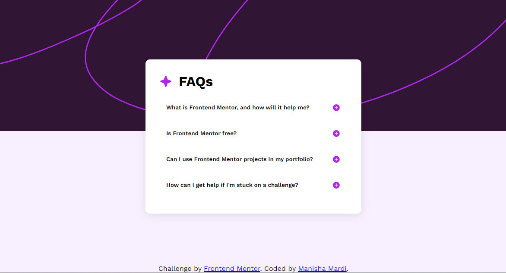

# Frontend Mentor - FAQ accordion solution

This is a solution to the [FAQ accordion challenge on Frontend Mentor](https://www.frontendmentor.io/challenges/faq-accordion-wyfFdeBwBz). Frontend Mentor challenges help you improve your coding skills by building realistic projects. 

## Table of contents

- [Overview](#overview)
  - [The challenge](#the-challenge)
  - [Screenshot](#screenshot)
  - [Links](#links)
- [My process](#my-process)
  - [Built with](#built-with)
  - [What I learned](#what-i-learned)
  - [Continued development](#continued-development)
  - [Useful resources](#useful-resources)
- [Author](#author)
- [Acknowledgments](#acknowledgments)

## Overview

### The challenge

Users should be able to:

- Hide/Show the answer to a question when the question is clicked
- Navigate the questions and hide/show answers using keyboard navigation alone
- View the optimal layout for the interface depending on their device's screen size
- See hover and focus states for all interactive elements on the page

### Screenshot

### Links

- Solution URL: (https://github.com/mardimanisha/faq-accordion)
- Live Site URL: (https://faq-accordion-seven-beta.vercel.app/)

## My process

### Built with

- Semantic HTML5 markup
- CSS custom properties
- Flexbox
- Mobile-first workflow
- JavaScript for interactivity

### What I learned

During this challenge, I focused on making the FAQ accordion both functional and accessible. Here are a few things I learned:

- Semantic HTML: Using button, section, and article elements appropriately to improve accessibility.
- CSS Transitions: Implementing smooth transitions for the accordion opening and closing.
- Responsive Design: Creating a responsive layout that adapts to both mobile and desktop screens using media queries.
- JavaScript :

Event Listeners:

DOMContentLoaded: Ensures that the script runs after the DOM is fully loaded.
click and keydown event listeners are used to toggle the accordion behavior.
ARIA Attributes:

aria-expanded: This attribute is used to indicate whether a section is expanded (true) or collapsed (false), improving accessibility for screen readers.
Dynamic Styling:

style.maxHeight: Controls the expansion and collapse of content sections by dynamically adjusting the maxHeight based on the content's scroll height.
Keyboard Accessibility:

keydown listener allows users to expand/collapse sections using the Enter or Space keys, ensuring the component is accessible via keyboard navigation.
DOM Traversal:

button.nextElementSibling: Efficiently selects the associated content section directly following the button, simplifying the code and improving performance.

### Continued development

In future projects, I want to explore more advanced accessibility features, such as implementing ARIA roles and live regions. Additionally, I aim to refine my CSS Grid skills for more complex layouts.

### Useful resources

- [MDN Web Docs - ARIA: Accessibility](https://developer.mozilla.org/en-US/docs/Web/Accessibility/ARIA) - This article helped me understand how to use ARIA attributes effectively.

## Author

- Frontend Mentor - [@ManishaMardi](https://www.frontendmentor.io/profile/mardimanisha)

## Acknowledgments

Thanks to the Frontend Mentor community for providing a platform to practice and improve coding skills.

